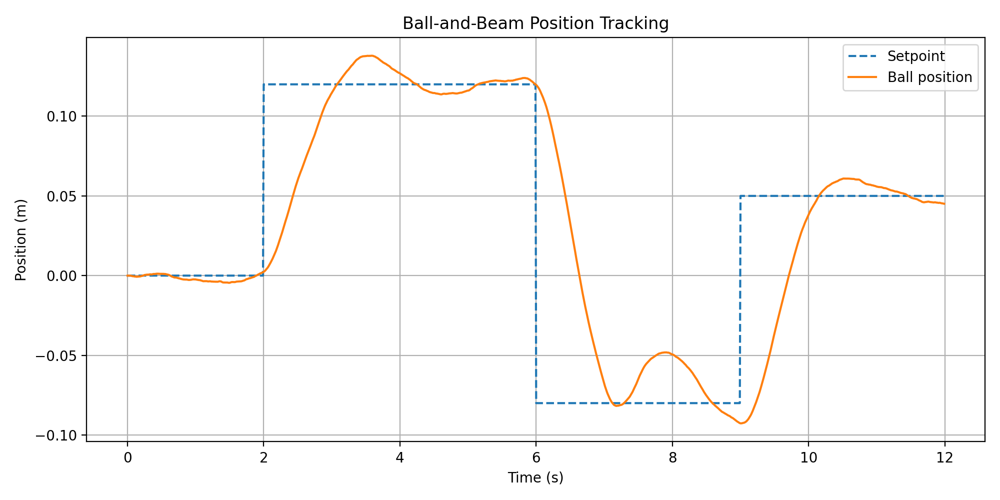
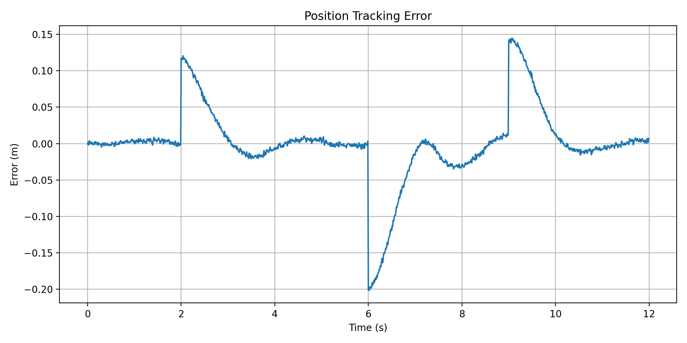
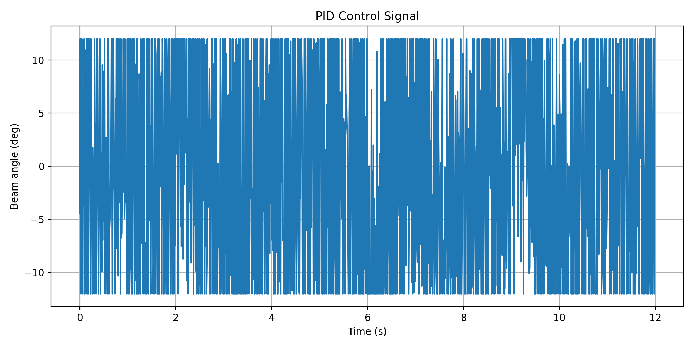
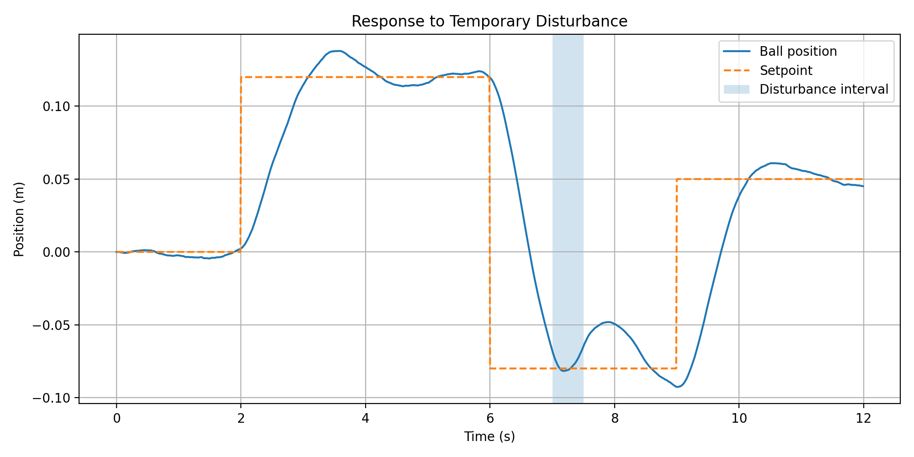
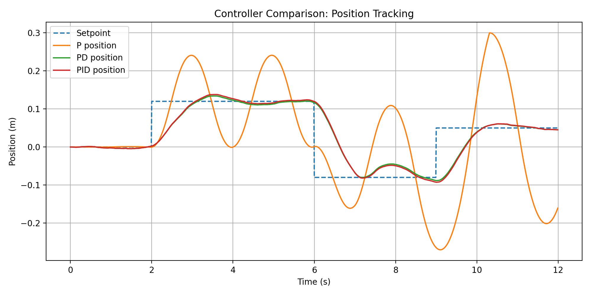
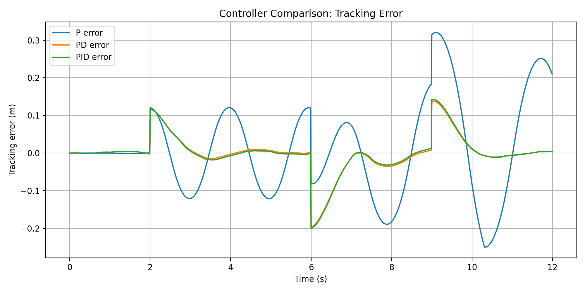
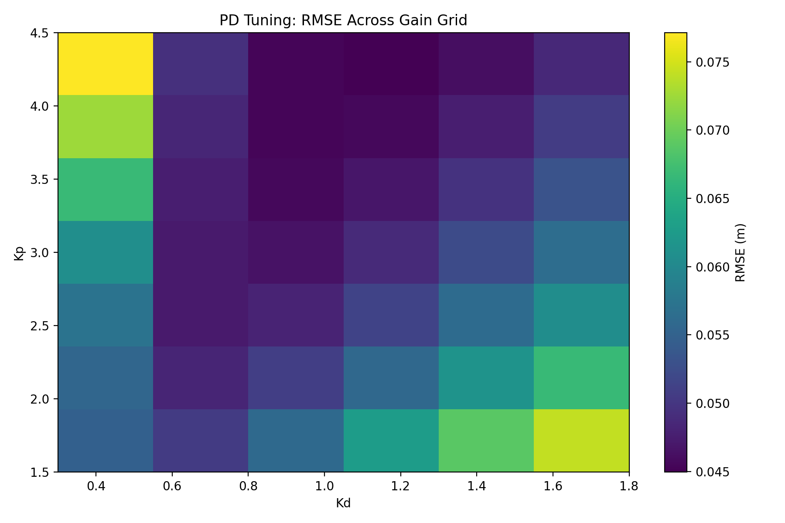
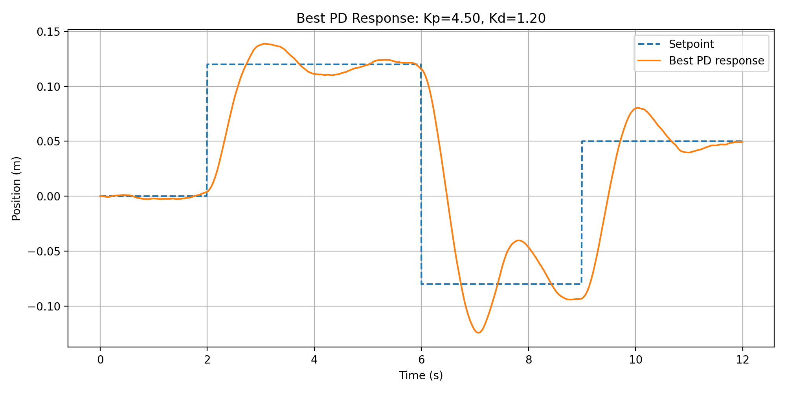

# Ball and Beam Control Simulation

Control-oriented simulation project for a classical ball-and-beam system using PID position control.

This project models a simplified ball-and-beam dynamic system where a controller adjusts the beam angle to move a ball toward a desired position. It is designed as a simulation-first step toward a future embedded hardware implementation using a servo motor, distance sensing, and real-time feedback control.

## Portfolio Context

This project is part of my Intelligent Physical Systems portfolio, focused on the connection between:

- Dynamic systems
- Feedback control
- Simulation and modeling
- Sensor-based measurement
- Embedded implementation planning
- Robotics and mechatronics-oriented control systems

The goal is not only to write code, but to build engineering evidence for modeling, controlling, and eventually implementing a physical feedback system.

## System Overview

The simulated system represents a ball moving along a beam. A PID controller receives the position error and commands a beam angle. The beam angle affects the acceleration of the ball.

A simplified control-oriented model is used:

x_ddot = K * sin(theta)

where:

- x is the ball position along the beam
- theta is the beam angle
- K is a simplified dynamics gain
- the PID controller adjusts theta to reduce position error

This model is intentionally simple and interpretable. It is useful for studying controller behavior, setpoint tracking, actuator saturation, disturbance response, and future embedded implementation constraints.

## Features

- Ball-and-beam position control simulation
- PID controller implementation from scratch
- Beam angle saturation to represent actuator limits
- Multi-step setpoint tracking
- Measurement noise to approximate sensor uncertainty
- Temporary disturbance injection
- Performance metrics calculation
- CSV logging of simulation data
- Position tracking, error, control signal, and disturbance response plots

## Results

The current simulation produces the following performance metrics:

| Metric | Value |
|---|---:|
| RMSE | 0.0511 m |
| Mean absolute error | 0.0268 m |
| Max absolute error | 0.1996 m |

The larger maximum error occurs mainly during setpoint transitions and disturbance response, which is expected in a constrained feedback-control simulation.

## Output Plots

### Position Tracking

### Tracking Error

### PID Control Signal

### Disturbance Response

## Controller Comparison

In addition to the baseline PID simulation, this project compares three feedback controllers under the same setpoint profile, measurement noise, actuator saturation, and disturbance condition:

- P controller
- PD controller
- PID controller

The comparison shows that derivative action significantly improves tracking performance compared with proportional-only control. In this simplified simulation, the PD controller performs slightly better than the PID controller, suggesting that the integral term is not always beneficial for this specific dynamic model and tuning setup.

| Controller | RMSE (m) | Mean Absolute Error (m) | Max Absolute Error (m) | Mean Abs Control (deg) |
|---|---:|---:|---:|---:|
| PD | 0.0503 | 0.0265 | 0.1965 | 9.0994 |
| PID | 0.0511 | 0.0268 | 0.1996 | 9.0981 |
| P | 0.1269 | 0.0965 | 0.3203 | 8.4911 |

### Controller Comparison Plots

## PD Controller Tuning

A PD tuning experiment was performed to explore how different proportional and derivative gains affect tracking performance.

The experiment evaluated a grid of Kp and Kd values under the same simulation conditions:

- identical setpoint profile
- identical measurement noise
- identical actuator saturation
- identical temporary disturbance
- identical simplified ball-and-beam dynamics

The best tested PD controller achieved:

| Parameter | Value |
|---|---:|
| Kp | 4.5 |
| Kd | 1.2 |
| RMSE | 0.0449 m |
| Mean Absolute Error | 0.0238 m |
| Max Absolute Error | 0.1958 m |
| Mean Abs Control Effort | 9.1989 deg |

This tuned PD controller outperformed the previous baseline PD and PID configurations in this simulation setup.

### Tuning Plots

## Generated Files

The simulation generates:

- results/ball_beam_simulation_data.csv
- results/performance_metrics.csv
- results/position_tracking.png
- results/tracking_error.png
- results/control_signal.png
- results/disturbance_response.png
- results/controller_comparison.csv
- results/controller_comparison_timeseries.csv
- results/controller_comparison_tracking.png
- results/controller_comparison_error.png
- results/pd_tuning_results.csv
- results/pd_tuning_best_response.csv
- results/pd_tuning_rmse_heatmap.png
- results/pd_tuning_best_response.png

## Project Structure

ball-and-beam-control-simulation/
- src/
  - simulate_ball_beam.py
- results/
  - ball_beam_simulation_data.csv
  - performance_metrics.csv
  - position_tracking.png
  - tracking_error.png
  - control_signal.png
  - disturbance_response.png
  - controller_comparison.csv
  - controller_comparison_timeseries.csv
  - controller_comparison_tracking.png
  - controller_comparison_error.png
  - pd_tuning_results.csv
  - pd_tuning_best_response.csv
  - pd_tuning_rmse_heatmap.png
  - pd_tuning_best_response.png
- docs/
- README.md
- requirements.txt
- .gitignore

## How to Run

Create and activate a virtual environment:

python3 -m venv venv
source venv/bin/activate

Install dependencies:

pip install -r requirements.txt

If working offline with a local wheelhouse:

pip install --no-index --find-links=/home/amir/python-wheels -r requirements.txt

Run the simulation:

python src/simulate_ball_beam.py

## Documentation

- [Model and Control Notes](docs/model_and_control.md)

## Future Hardware Direction

A future hardware version of this project may use:

- ESP32 microcontroller
- Servo motor for changing beam angle
- Distance sensor for measuring ball position
- PID control running on embedded hardware
- Serial logging for analysis
- Python scripts for plotting real response data

This future version would extend the project from simulation into a real cyber-physical control system.

## Engineering Notes

This project is intentionally structured as a bridge between simulation and hardware. The simulation includes practical elements such as actuator saturation, measurement noise, and disturbance response because real control systems are affected by physical constraints, noisy measurements, and external perturbations.

## Key Engineering Takeaways

- Feedback control performance depends strongly on controller structure and gain tuning.
- Derivative action significantly improved tracking compared with proportional-only control.
- A tuned PD controller outperformed the baseline PID controller in this simplified setup.
- More complex controllers are not automatically better; performance must be evaluated with metrics.
- Actuator saturation, measurement noise, and disturbance response are important even in simulation.
- This project provides a simulation foundation for a future hardware ball-and-beam control system.

## Current Status

Simulation phase complete.

The project currently includes a baseline PID simulation, P/PD/PID controller comparison, PD gain tuning, performance metrics, response plots, and model/control documentation. Future work should focus on hardware implementation only after the required mechanical and electronic components are available.
